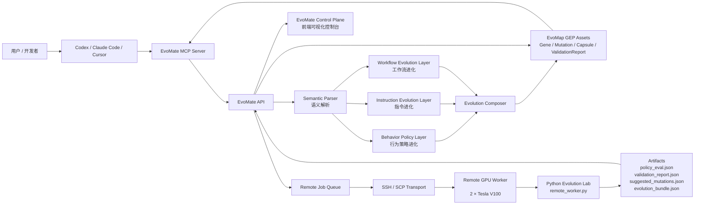
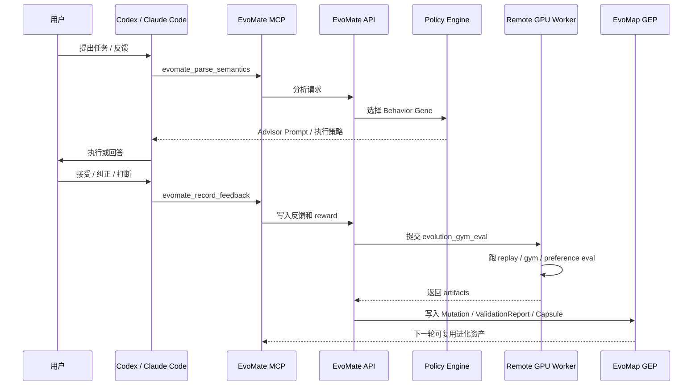
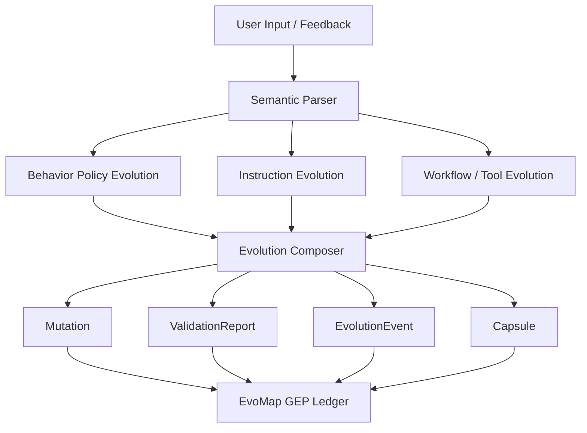
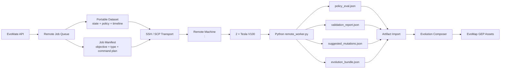

# EvoMate Architecture Diagrams

## One-line Architecture

```text
EvoMate = Local Real-time Agent Runtime + Remote Evolution Lab + EvoMap GEP Asset Layer
```

## Complete Roadshow Architecture



## Runtime + Evolution Sequence



## Three Evolution Layers



## Remote Compute Distribution



## Current Verified Remote Run

```text
Job: job_evolution_gym_eval_20260619090850_996f86
Target: <remote-user>@<remote-host>:<port>
GPU: 2 × Tesla V100 32GB
Status: imported
Baseline: 0.61
Evolved: 0.78
Improvement: +0.17 / +27.87%
Bundle: bundle_job_evolution_gym_eval_20260619090850_996f86
```

## Roadshow Talk Track

> 实时决策在本地 MCP，保证低延迟和可控；长期进化分发到远程 GPU，生成可验证的 Mutation、ValidationReport 和 EvolutionBundle，再回写 EvoMap，让 Agent 每轮反馈后真的变强。
